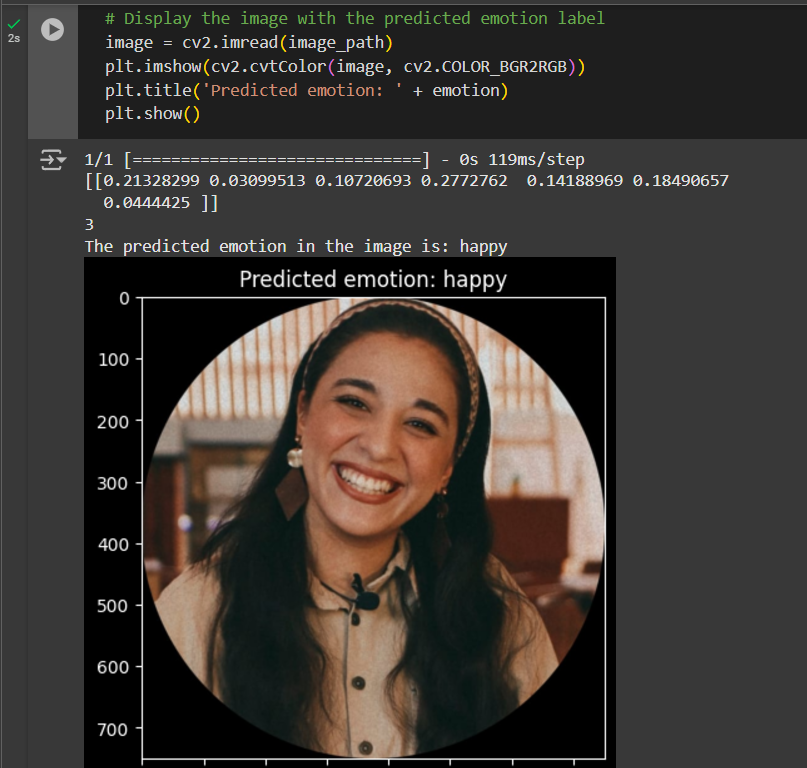

# Facial Emotion Detection using Deep Learning

### Overview
This repository implements a deep learning model for facial emotion detection using the FER2013 dataset.

## FER2013 Dataset

The FER2013 dataset contains 35,887 images of facial expressions labeled with seven distinct emotions:

Anger
Disgust
Fear
Happiness
Sadness
Surprise
Neutral
Output Example
Emotion Detection:
Wider Face Dataset

A well-known dataset for face detection containing over 32,000 images with bounding box annotations for faces.

### Output Example

  

### API Integration with FastAPI
The repository also includes a FastAPI implementation to provide a modern, efficient API for real-time emotion detection:

### Features:
Upload an image or use a webcam to capture a photo.

### References
FER2013 Dataset
